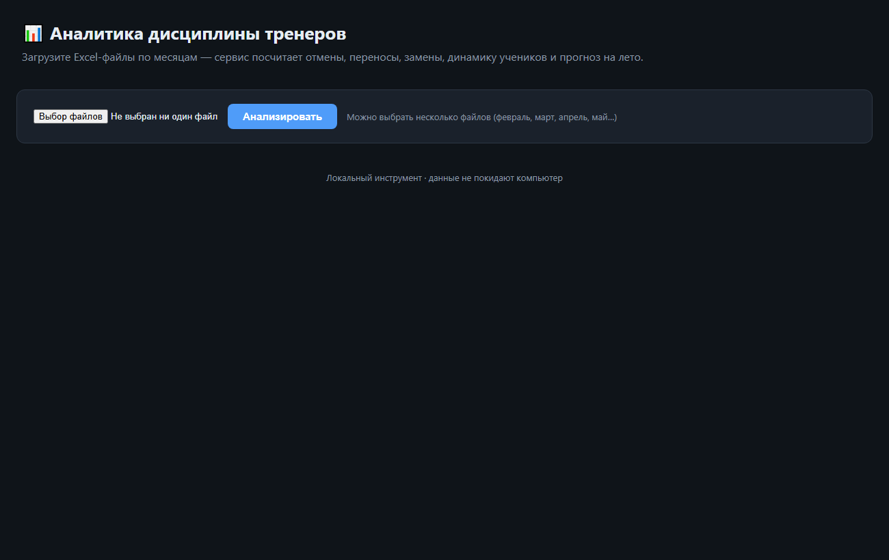
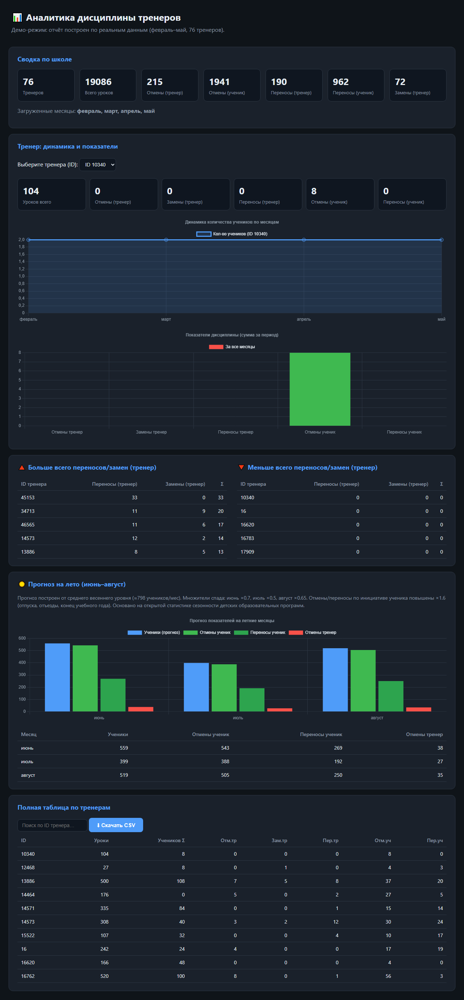

# 📊 Аналитика дисциплины тренеров (Teacher Analytics)

Локальный веб-сервис: загружаешь Excel-файлы по месяцам — получаешь
наглядный отчёт по каждому тренеру и по школе в целом.

 

## Что считает

1. Отмены по инициативе тренера
2. Отмены по инициативе ученика
3. Переносы по инициативе тренера
4. Переносы по инициативе ученика
5. Линейный график динамики количества учеников (при выборе тренера)
6. Прогноз показателей на лето (июнь–август)
7. Тренеры с наибольшим числом переносов/замен по инициативе тренера
8. Тренеры с наименьшим числом переносов/замен по инициативе тренера

Замены и отмены показываются **раздельно**. Расчёты детерминированные
(на сервере, без ИИ) — повторяемо и точно.



## Требования

- Python 3.10+
- Пакеты из `requirements.txt`

## Установка

```powershell
cd C:\Users\User\Desktop\project\teacher-analytics
pip install -r requirements.txt
```

## Быстрый запуск «в один проклик» (Windows)

В корне проекта лежит готовый скрипт запуска **`start.bat`**.
Достаточно дважды кликнуть по нему — он сам:

1. установит зависимости (`pip install -r requirements.txt`);
2. запустит локальный сервер Flask;
3. откроет браузер на **http://127.0.0.1:5000**.

```bat
start.bat
```

> `start.txt` — та же команда в виде текста (удобно посмотреть содержимое без запуска).
> Если путь к проекту отличается от `C:\Users\User\Desktop\project\teacher-analytics`,
> поправьте строку `cd /d ...` в начале `start.bat`.

## Запуск вручную

```powershell
python app/server.py
```

Открой в браузере: **http://127.0.0.1:5000**

Останавливается сочетанием `Ctrl+C` в окне терминала.

## Как пользоваться

1. Нажми «Выберите файлы», отметь Excel-файлы по месяцам
   (например, `февраль.xlsx`, `март.xlsx`, `апрель.xlsx`, `май.xlsx`).
2. Нажми **«Анализировать»**.
3. Смотри отчёт:
   - **Сводка по школе** — итоговые показатели.
   - **Тренер** — выбери ID в выпадающем списке → динамика учеников и
     диаграмма дисциплины.
   - **Топ / антитоп** — кто чаще/реже всех переносит и заменяет.
   - **Прогноз на лето** — июнь–август с пояснением методики.
   - **Полная таблица** — все тренеры, с поиском по ID.

## Формат входных файлов

Лист **«Дисциплина»**, первая строка — заголовки ровно в таком порядке:

| ID тренера | Общее кол-во уроков | Количество учеников | Отмены по инициативе тренера | Замены по инициативе тренера | Переносы по инициативе тренера | Переносы по инициативе ученика | Отмены по инициативе ученика |
|---|---|---|---|---|---|---|---|

Название месяца берётся из имени файла. При несовпадении структуры
сервис покажет понятную ошибку и не сломается.

## Структура проекта

```
teacher-analytics/
├── app/
│   ├── server.py          # Flask-сервер (роуты / и /analyze)
│   ├── analytics.py       # ядро: парсинг, расчёты, прогноз
│   ├── templates/
│   │   └── index.html     # страница отчёта
│   └── static/
│       ├── style.css
│       └── app.js         # фронтенд, графики Chart.js
├── skills/                # скилы агента для этого проекта
│   ├── excel-report/
│   └── run-dashboard/
├── docs/
│   └── PROJECT.md         # описание по шаблону + методика прогноза
├── start.bat               # запуск «в один проклик» (Windows)
├── start.txt               # текстовая копия команд запуска
├── CLAUDE.md               # файл персоналии агента (контекст и правила)
├── requirements.txt
└── README.md
```

## Файл персоналии агента

`CLAUDE.md` — описание контекста и правил работы агента над этим проектом:
кто пользователь (руководитель команды тренеров), какие задачи решаются,
как согласуются действия и какие границы нельзя переходить. Используется как
постоянный контекст для агента при работе с этим инструментом.

## Настройка прогноза

Коэффициенты сезонного спада — в `app/analytics.py`
(`SUMMER_FACTORS`, `SUMMER_STUDENT_CANCEL_UPLIFT`). Их можно менять или
заменить на реальный файл каникул/отпусков, когда он появится. Методика и
источники — в `docs/PROJECT.md`.
